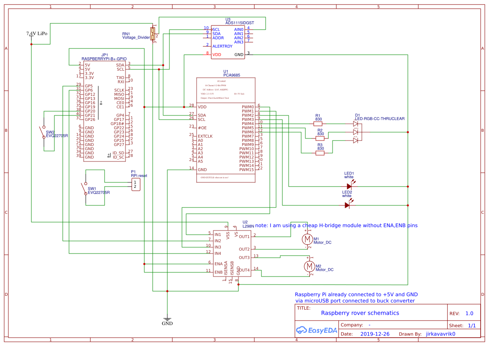

# Raspberry rover firmware

Raspberry rover is a Raspberry pi Zero powered vehicle that can be controlled from an Android phone (see https://uloz.to/file/HlUxqMbNuQFR/raspberry-rover-control-apk) or a PC (see https://github.com/jirkavavrik/raspberry-rover-socket-control).

main features:
* two DC motors to move around
* A Raspberry Pi Camera - viewing real-time image in a web browser
* two white leds as headlights
* a status indicating rgb led
* voltage sensing (voltage divider and ads1115) to protect the Li-Po
* reset and power-down buttons

other specs:
* Raspberry Pi Zero with wifi
* pca9685 for PWM outputs
* 1,5 Ah Li-Po with a buck converterter for power
* L298 DC motor driver

Photo:

## Schematics

See image below or download pdf (https://github.com/jirkavavrik/raspberry-rover-firmware/blob/master/doc/Schematic_Raspberry-rover.pdf)

